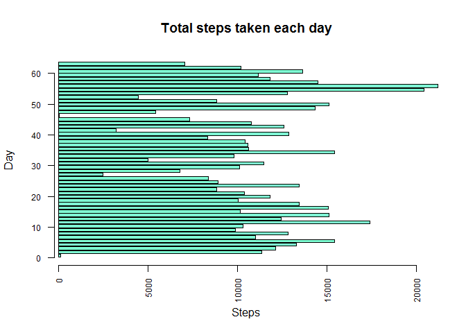
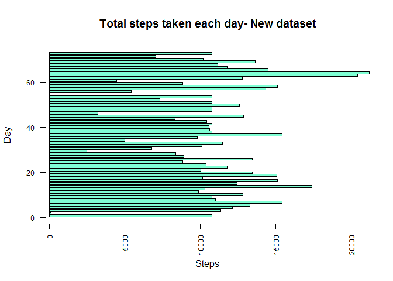
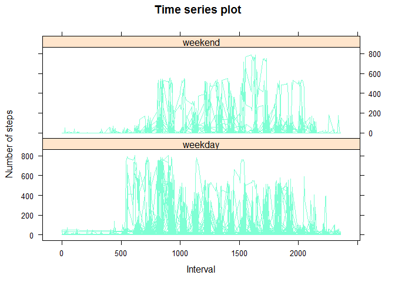

# <p align="center"> <b> Assessment 1 </b> </p>
<p align="center"> *Author: PG* </p>


##**Loading and preprocesing the data**

```r
data<- read.csv("activity.csv") #Reading the data
head(data, 3) #Exploring the data
```

```
##   steps       date interval
## 1    NA 2012-10-01        0
## 2    NA 2012-10-01        5
## 3    NA 2012-10-01       10
```

```r
good<- complete.cases(data) #Removing rows with missing values
data<- data[!good==FALSE, ]
head(data, 3) #Checking
```

```
##     steps       date interval
## 289     0 2012-10-02        0
## 290     0 2012-10-02        5
## 291     0 2012-10-02       10
```

##**What is mean total number of steps taken per day?**
Total number of steps taken per day

```r
totalsteps<- aggregate(data$steps, list(Date=data$date), sum)
head(totalsteps, 3)
```

```
##         Date     x
## 1 2012-10-02   126
## 2 2012-10-03 11352
## 3 2012-10-04 12116
```

Histogram of the total number of steps taken each day

```r
barplot(totalsteps$x, horiz = TRUE, col="aquamarine", main="Total steps taken each day", xlab="Steps", ylab="Day", axes = F)
axis(1, las=3, cex.axis=0.75)
axis(2, las=1, cex.axis=0.75)
```

 

Mean and Median of the total number of steps taken per day

```r
mean(totalsteps$x)
```

```
## [1] 10766.19
```

```r
median(totalsteps$x)
```

```
## [1] 10765
```

##**What is the average daily activity pattern?**
Time series plot of the 5-minute interval and the average number of steps taken

```r
meansteps<- aggregate(data$steps, list(Interval=data$interval), mean) #Calculating mean steps for each interval
plot(meansteps$Interval, meansteps$x, type="l", main="Time series plot", xlab="5-minute interval", ylab="Average number of steps", col="aquamarine", lwd=4)
```

 

Calculating 5-minute interval, on average across all the days, that contains the maximum number of steps

```r
meansteps$Interval[max(meansteps$x)]
```

```
## [1] 1705
```


##**Imputing missing values**
Total number of missing values in the dataset

```r
data<- read.csv("activity.csv") #Reading the data again (I eliminated NAs rows in the firsts steps)
length(which(is.na(data)))
```

```
## [1] 2304
```

Filling missing values with the mean for that 5-minute interval and creating a new dataset with the missing data filled

```r
nonas<- data
nonas$steps[is.na(nonas$steps)]<- mean(nonas$step, na.rm=T)
head(nonas, 3)
```

```
##     steps       date interval
## 1 37.3826 2012-10-01        0
## 2 37.3826 2012-10-01        5
## 3 37.3826 2012-10-01       10
```

Histogram of the total number of steps taken each day

```r
totalsteps2<- aggregate(nonas$steps, list(Date=nonas$date), sum)
barplot(totalsteps2$x, horiz = TRUE, col="aquamarine", main="Total steps taken each day- New dataset", xlab="Steps", ylab="Day", axes = F)
axis(1, las=3, cex.axis=0.75)
axis(2, las=1, cex.axis=0.75)
```

 

Mean and Median of total number of steps taken per day

```r
mean(totalsteps2$x)
```

```
## [1] 10766.19
```

```r
median(totalsteps2$x)
```

```
## [1] 10766.19
```
Like I had removed already the misssing values, the impact of imputing missing data on the estimates of the total daily number of steps is indiscernible.


##**Are there differences in activity patterns between weekdays and weekends?**
Creating a new factor variable in the dataset with two levels indicating whether a given date is a weekday or weekend day

```r
total<- weekdays(as.POSIXlt(data$date), abbreviate= TRUE)
data$day<- as.factor(total)
levels(data$day)
```

```
## [1] "do." "ju." "lu." "ma." "mi." "sá." "vi."
```

```r
library(car)
data$day<- recode(data$day, "c('ju.', 'lu.', 'ma.', 'mi.', 'vi.')='weekday'; c('sá.', 'do.')='weekend'")
levels(data$day)
```

```
## [1] "weekday" "weekend"
```

Panel plot containing a time series plot of the 5-minutes interval and the average number of steps taken, averaged across all weekday days or weekend days.

```r
library(lattice)
attach(data)
xyplot(steps~interval|factor(day), data=data, main="Time series plot", ylab="Number of steps", xlab="Interval", layout=c(1,2), type="l", col="aquamarine")
```

 

